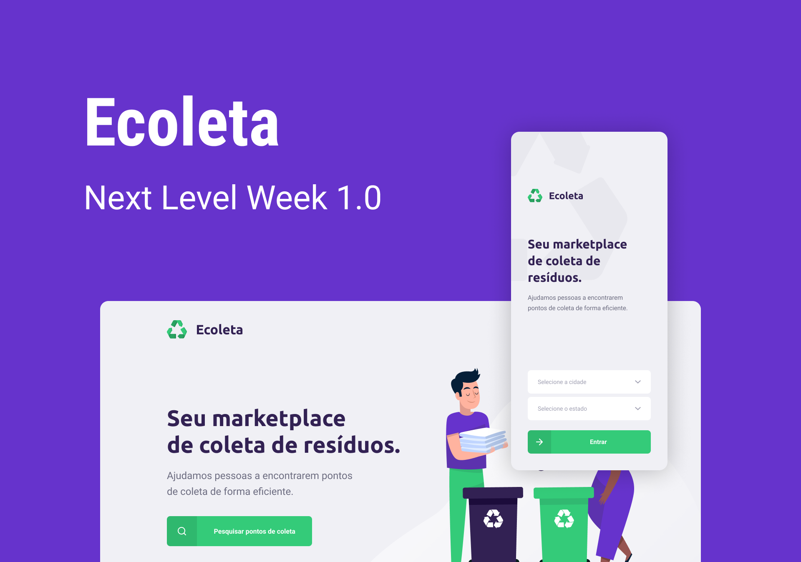

<p align="center"></p>

<p align="center">O Projeto foi desenvolvido durante a <b>NLW - Next Level Week #01</b> oferecida pela <a href="https://rocketseat.com.br/">Rocketseat</a>.</p>

<p align="center">
  

  
  	
  <a href="https://www.linkedin.com/in/gabrielmnzs/">
    
  </a>	
  
  <a href="https://github.com/gabrielmnzs/Ecoleta/commits/master">
    
  </a>

  
   <a href="https://github.com/gabrielmnzs/Ecoleta/stargazers">
    
  </a>
</p>

### 📄 Descrição:

O <b>Ecoleta</b> é uma solução capaz de conectar empresas de coleta de resíduos à pessoas interessadas em fazer descarte desses resíduos.

### 💻 Tecnologias utilizadas:

* [Typescript](https://www.typescriptlang.org/)
* [NodeJS](https://nodejs.org/)
* [Express](https://expressjs.com/pt-br/)
* [Knex](https://knex.org/)
* [ReactJS](https://reactjs.org/)
* [React Native](https://reactnative.dev/)
* [Expo](https://expo.io/)

### 👓 Rodando a aplicação:

>OBS: pode-se utilizar o gerenciador de pacotes npm ou o yarn para rodar os comandos abaixo

Execute ```npm install``` nas pastas backend, frontend e mobile, para instalar as dependências.

#### Iniciar o servidor:

```npm run dev```

#### Criar migrations:

```knex:migrate```

#### Criar as seeds:

```knex:seed```

#### Iniciar frontend:

```npm start```

#### Iniciar mobile com expo:

```expo start```

